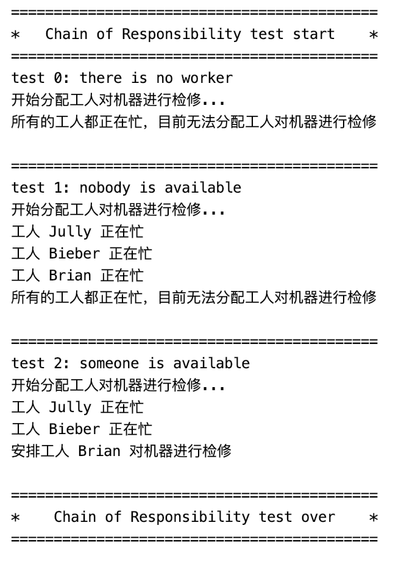

## ChainOfResponsibility

### 测试逻辑

Chain of Responsibility模式通过给多个对象处理请求的机会，避免请求的发送方与其接收方耦合。将接收对象串接起来，并沿着职责链传递请求，直到有一个对象处理它。此项目中职责链用在检修机器上，检修职责在职责链上传递，直到有工人有空检修机器或所有人都正忙无法检修。

### 测试用例

1. 创建3个工人（Worker类）
2. 设置工人的属性（姓名、是否空闲）
3. 将工人加入经理类中维修机器的职责链中
4. 调用经理单例的维修方法，检查职责链
5. 分别在没工人、所有工人都不空闲、有人空闲三种情况下做上述测试

### 功能测试

## 评分

| 设计模式               | Class/Interface API            | framework完成度 （正确性25+合理性25） | Sample program/Application （正确性25+合理性25） | 备注（主要问题）                 |
| ---------------------- | ------------------------------ | ------------------------------------------ | ----------------------------------------------------- | -------------------------------- |
| ChainOf Responsibility | WorkerManager: repairMachine() | 23+24                                      | 22+24                                                 | 样例程序输出有问题，多次重复输出 |

