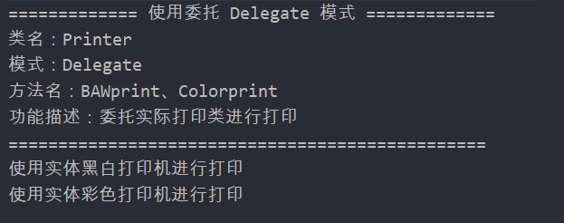

## Delegate

### 测试逻辑

项目中使用打印机实现了Delegate委派模式，通过创建一个Printer对象来进行黑白打印和彩色打印来进行测试。

### 测试用例

1. 创建一个printer对象
2. 执行BAWprint()进行黑白打印
3. 执行colorPrint()进行彩色打印

### 功能测试

## 评分

| 设计模式 | Class/Interface API                       | framework完成度 （正确性25+合理性25） | Sample program/Application （正确性25+合理性25） | 备注 |
| -------- | ----------------------------------------- | ------------------------------------------ | ----------------------------------------------------- | ---- |
| Delegate | Printer BAWPrinter ColorPrinter | 24+24                                      | 25+25                                                 | 无   |

