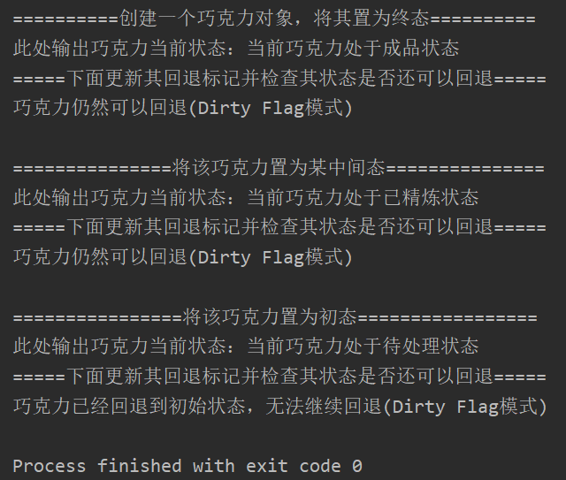

## 测试文档框架

### 测试逻辑

模拟巧克力回炉的过程，创建一个巧克力实例，修改其状态，并更新回退标记并输出当前是否能够回退

### 测试用例

1. 创建一个巧克力对象
2. 创建一个布尔型变量flag用作回退标记
3. 使用changeState将其状态置为Finish（终态）
4. 使用setFlag方法修改flag并使用stateJudgement判断能否回退并输出
5. 使用changeState将其状态置为Refined（某中间态）
6. 使用setFlag方法修改flag并使用stateJudgement判断能否回退并输出
7. 使用changeState将其状态置为ToProcess（始态）
8. 使用setFlag方法修改flag并使用stateJudgement判断能否回退并输出

### 功能测试

项目对脏标记模式使用的选择的具体情境还是比较合理正确的：使用一个标志位来记录巧克力的当前状态还能执行回退操作，但是该模块在编写代码时存在以下问题：标志位需要使用时用户自己定义boolean变量并传入相应方法修改或判断，而且没有将回退操作的执行与标志位的判断关联起来，使得项目虽然实现了脏标记模式，但是没有将它用到具体的功能中从而起到优化回退操作增强鲁棒性的作用，若要实现相关限制需要用户在执行回退操作时另行声明标记变量并调用相关方法进行赋值，然后用户自行编写分支结构的代码来实现这些功能，因此本模式实现结果从正确性与合理性上都有需要完善之处，因此酌情扣分。

## 评分

| 设计模式   | Class/Interface API                                          | framework完成度 （正确性25+合理性25） | Sample program/Application （正确性25+合理性25） | 备注 |
| ---------- | ------------------------------------------------------------ | ------------------------------------------ | ----------------------------------------------------- | ---- |
| Dirty Flag | chocolateStateMemento.setFlag(Chocolate chocolate, boolean flag)  chocolateStateMemento.stateJudgement(boolean flag) | 22+20                                      | 25+24                                                 |      |

