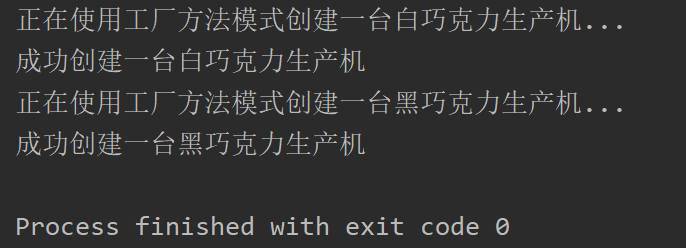

## Factory Method

### 测试逻辑

首先使用分别构造白巧克力生产机器工厂和黑巧克力生产机器工厂的实例，然后分别调用这两个工厂的相应方法生成对应机器的实例。

### 测试用例

1. 实例一个白巧克力生产机工厂，用抽象工厂接口来接收
2. 通过抽象工厂中定义的方法createMachine来生成白巧克力生产机器对象
3. 实例一个黑巧克力生产机工厂，用抽象工厂接口来接收
4. 通过抽象工厂中定义的方法createMachine来生成黑巧克力生产机器对象

### 功能测试

基本逻辑实现上以及选取实现的基本功能上是正确的，但是在模式的功能与交互接口设计上没有实现用户给定要生产内容的名字（字符串）就完成对应生产的方法，这使得这一模块可能违背了依赖倒置原则，而且在项目中工厂方法中的“产品”是巧克力生产机器，这部分内容略微超出了巧克力工厂这个主题的范畴，因此使用情景上有些不符合现实逻辑，因此酌情扣分。

## 评分

| 设计模式       | Class/Interface API     | framework完成度 （正确性25+合理性25） | Sample program/Application （正确性25+合理性25） | 备注 |
| -------------- | ----------------------- | ------------------------------------------ | ----------------------------------------------------- | ---- |
| Factory Mathod | MachineFactory.create() | 24+23                                      | 25+23                                                 |      |

