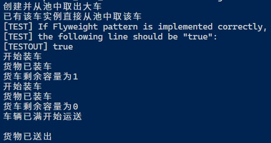

## Flyweight

### 测试逻辑

根据Flyweight的实现方式，用户向工厂类申请实例引用时，如果工厂类中已创建了该类型的实例，则直接返回该实例的引用，不在新建实例。故用户向工厂类申请两个相同类型实例的引用，其指向的实例应该是相同的。

### 测试用例

1. 用户生成一个Chocolate[]数组。
2. 用户调用FlyweightFactory.getFlyweight()获取同一种Car的两个实例引用。
3. 用户判断两个引用是否指向同一个实例。
4. 用户对两个实例引用分别调用Car.operate()。
5. 【边界测试】用户向FlyweightFactory.getFlyweight()传入非法值。

### 功能测试

### 边界测试

## 评分

| 设计模式  | Class/Interface API                                | framework完成度 （正确性25+合理性25） | Sample program/Application （正确性25+合理性25） | 备注                                                         |
| --------- | -------------------------------------------------- | ------------------------------------------ | ----------------------------------------------------- | ------------------------------------------------------------ |
| Flyweight | FlyweightFactory.getFlyweight() Car.operate() | 50                                         | 46                                                    | 【重要问题】设计模式的应用不够合理。用户生成同一种Car的多个引用并分别调用operate()来“分别装载少量巧克力”，结果因为指向的是同一实例而“到达其容量上限”。文档对这一行为的合理性没有说明。 【次要问题】模式的设计不够满足OCP原则。如果要设计一个新的Car子类，则该部分代码需要添加新的判断。 |

