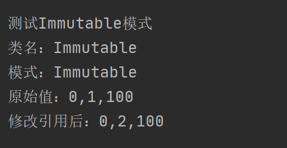

## Immutable

### 测试逻辑

一个对象的状态在对象创建之后就不再变化，这就是所谓的不变模式（Immutable Pattern）。一般地讲，一个对象要么是可变对象（Mutable Object），要么是不变对象（Immutable Object）。不变模式缺少改变自身状态的行为，因此它是关于行为的，所以把它划归为行为模式。

测试时主要测试生成一种模式，确定其原始值后，对其进行引用后的修改。

### 测试用例

1. 生成一个模式，对其类名、模式名、原始值进行设置为Immutable，并设置serviceTime。
2. 分别输出引用前和引用后的值。

### 功能测试

注：没有比较合理的类的使用，且只有weak Immutable的例子，Immutable的不变性体现的不到位。

## 评分

| 设计模式  | Class/Interface API                                          | framework完成度 （正确性25+合理性25） | Sample program/Application （正确性25+合理性25） | 备注 |
| --------- | ------------------------------------------------------------ | ------------------------------------------ | ----------------------------------------------------- | ---- |
| Immutable | Class： ImmutableTable Interface API ： getTbale、 getNum、 getServiceTime | 23+23                                      | 25+23                                                 | 无   |

