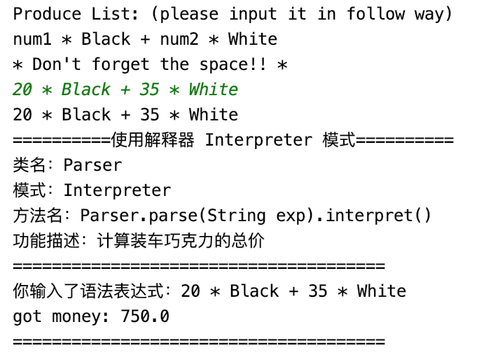

## Interpreter

### 测试逻辑

Interpreter允许用户输入一个表达式，然后对其进行计算，返回计算结果。此项目中解释器模式提供了计算销售商品总价值的功能，允许用户输入一个复合表达式（乘法和加法表达式），其叶节点表达式为乘法因子和巧克力的颜色（Black 和 White）。

本测试要求用户输入一个表达式，然后调用Phaser对其计算，将计算结果输出，检测解释器计算的是否准确。

### 测试用例

1. 创建一个Scanner对象，让用户输入一个表达式
2. 调用Phaser的phaser()方法进行计算
3. 输出计算结果

### 功能测试

## 评分

| 设计模式    | Class/Interface API | framework完成度 （正确性25+合理性25） | Sample program/Application （正确性25+合理性25） | 备注（主要问题）                                             |
| ----------- | ------------------- | ------------------------------------------ | ----------------------------------------------------- | ------------------------------------------------------------ |
| Interpreter | Phaser.phaser()     | 25+24                                      | 20+24                                                 | 样例程序中的输入部分无法输入，原因可能是直接读取了buffer里的空格，导致所有表达式都是0 * Black + 0 * White  |
