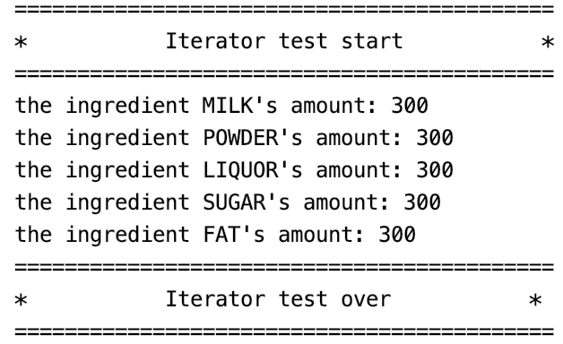

## Iterator

### 测试逻辑

迭代器模式提供一种方法顺序访问一个聚合对象中的各种元素，而又不暴露该对象的内部表示。此项目中的迭代器模式用于实现了一个泛型容器Menu，用来管理仓库中的原料。本测试调用迭代器对Menu中的原材料进行遍历检查。

### 测试用例

1. 创建一个工厂
2. 创建菜单
3. 创建迭代器
4. 遍历菜单并输出

### 功能测试

## 评分

| 设计模式 | Class/Interface API | framework完成度 （正确性25+合理性25） | Sample program/Application （正确性25+合理性25） | 备注（主要问题）                       |
| -------- | ------------------- | ------------------------------------------ | ----------------------------------------------------- | -------------------------------------- |
| Iterator | Menu：Iterator()    | 23+20                                      | 20+15                                                 | Iterator的测试嵌套在中介者类里，不合适 |

