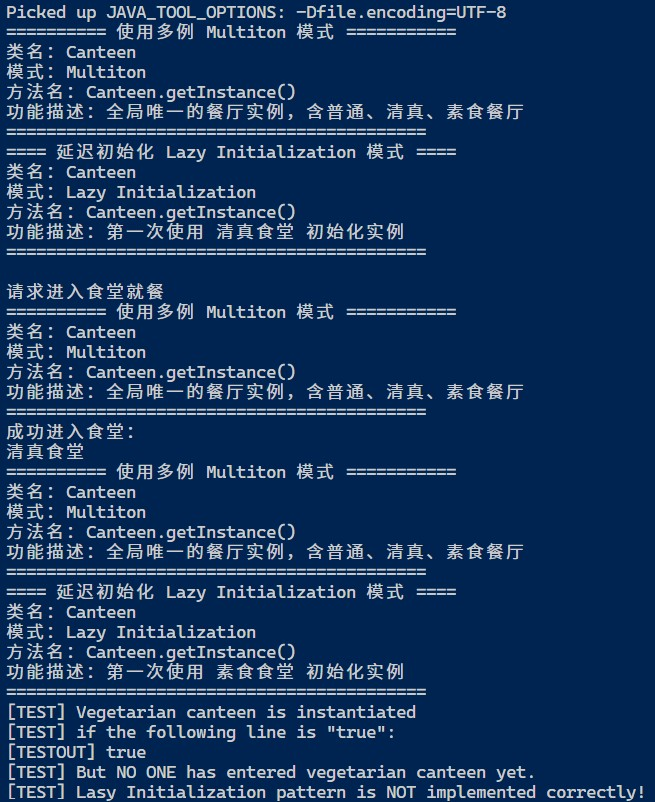

## Servant

### 测试逻辑

根据Lasy Initialization的逻辑，用户第一次调用相关属性才开始创建实例。测试相关实例是否在第一次使用时才开始创建。

### 测试用例

*(由于设计模式实现方式存在的问题，本测试反证其不正确性。)*

1. 用户向Canteen.getInstance()传入CanteenType.HALAL获取一个引用。
2. 用户调用Canteen.enterCanteen()进入该食堂。
3. 用户向Canteen.getInstance()传入CanteenType.VEGETARIAN获取一个引用，但不调用Canteen.enterCanteen()。
4. 测试3中的实例是否已经创建了，若成功创建一个没有使用的实例，则模式错误。

### 功能测试



## 评分

| 设计模式            | Class/Interface API                               | framework完成度<br />（正确性25+合理性25） | Sample program/Application<br />（正确性25+合理性25） | 备注                                                         |
| ------------------- | ------------------------------------------------- | ------------------------------------------ | ----------------------------------------------------- | ------------------------------------------------------------ |
| Lasy Initialization | Canteen.getInstance()<br />Canteen.enterCanteen() | 20+23                                      | 20+23                                                 | 【主要问题】文档中对该模式的应用陈述如下：“程序仅实例化客户要去的食堂，其它食堂不被创建。”但是通过测试用例，用户成功创建了一个“客户不会去的食堂”实例。其根本原因在于`enterCanteen()`不是`static`方法，这意味着用户调用该方法前必须实例化对象。这违反了Lasy Initialization中“直到对象第一次使用才初始化它”的逻辑。 |

## 建议实现

```java
package Multiton;

import Constant.Const.CanteenType;

import java.util.EnumMap;

/**
 * Reimplement of du mei's Canteen class.
 *
 * @author Ngae Zeh-ghau
 * @function dining in canteen
 * @pattern Multiton, Lazy initialization
 */
public class Canteen {
    private static final EnumMap<CanteenType, Canteen> instances = new EnumMap<>(CanteenType.class);

    private final CanteenType type; // type of canteen

    /**
     * Constructor of Canteen
     *
     * @param type type of canteen
     */
    private Canteen(CanteenType type) {
        this.type = type;
    }

    /**
     * private method, get instance of Canteen
     *
     * @param type type of canteen
     * @return instance of Canteen
     */
    private static Canteen getInstance(CanteenType type) {
        System.out.println("========== 使用多例 Multiton 模式 ===========\n" + "类名：Canteen\n" + "模式：Multiton\n"
                + "方法名：Canteen.getInstance()\n" + "功能描述：全局唯一的餐厅实例，含普通、清真、素食餐厅\n"
                + "==========================================");
        if (!instances.containsKey(type)) {
            String str_type;
            switch (type) {
                case GENERAL:
                    str_type = "普通食堂";
                    break;
                case HALAL:
                    str_type = "清真食堂";
                    break;
                case VEGETARIAN:
                    str_type = "素食食堂";
                    break;
                default:
                    str_type = "---类型错误---";
                    break;
            }
            System.out.println("==== 延迟初始化 Lazy Initialization 模式 ====\n" + "类名：Canteen\n" + "模式：Lazy Initialization\n"
                    + "方法名：Canteen.getInstance()\n" + "功能描述：第一次使用 " + str_type + " 初始化实例\n"
                    + "==========================================");
            Canteen instance = new Canteen(type);
            instances.put(type, instance);
        }
        return instances.get(type);
    }

    /**
     * Enter canteen.
     * 
     * @param type type of canteen
     * @return instance of Canteen just entered
     */
    public static Canteen enterCanteen(CanteenType type) {
        System.out.println("\n请求进入食堂就餐");
        Canteen canteenEntered = Canteen.getInstance(type);
        System.out.println("成功进入食堂：");
        switch (type) {
            case GENERAL:
                System.out.print("普通食堂\n");
                break;
            case HALAL:
                System.out.print("清真食堂\n");
                break;
            case VEGETARIAN:
                System.out.print("素食食堂\n");
                break;
            default:
                System.out.print("---错误类型---\n");
                break;
        }

        return canteenEntered;
    }

    /**
     * @return the type
     */
    public CanteenType getType() {
        return type;
    }
}
```

