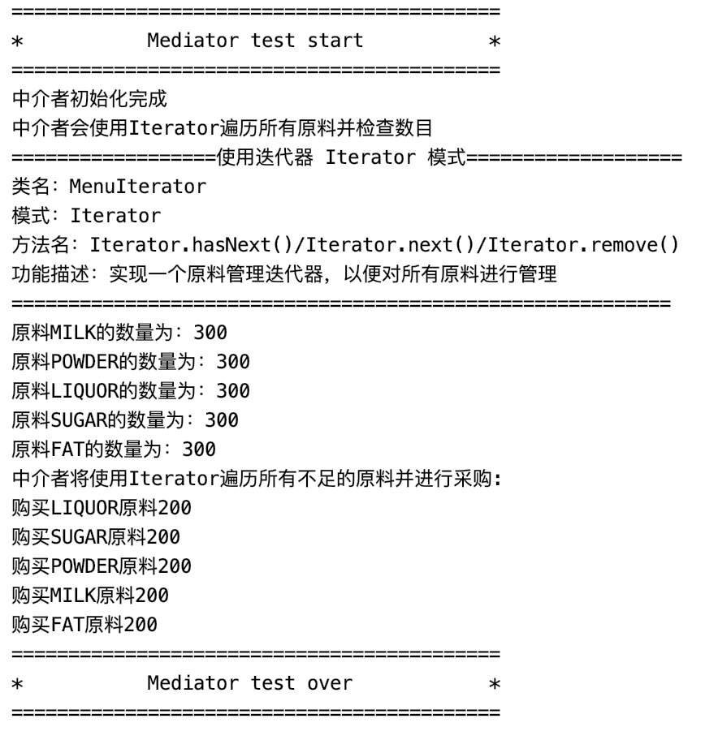

## Mediator

### 测试逻辑

系统规模较大的项目中，对象间的通信非常复杂，可以提供一个专门处理对象间交互和通信的类，作为中介者，可以降低系统复杂度。本测试通过调用中介者类中的colleagueChanged()方法来测试中介者模式。

### 测试用例

1. 创建一个工厂
2. 创建原料中介者
3. 分别设置工厂的原料中介者和原料中介者的工厂
4. 调用中介者的colleagueChanged()方法测试是否有效

### 功能测试

## 评分

| 设计模式 | Class/Interface API                    | framework完成度 （正确性25+合理性25） | Sample program/Application （正确性25+合理性25） | 备注                                                         |
| -------- | -------------------------------------- | ------------------------------------------ | ----------------------------------------------------- | ------------------------------------------------------------ |
| Mediator | ingredientMediator：colleagueChanged() | 20+22                                      | 20+15                                                 | 【主要问题】中介者模式的样例程序中混杂迭代器模式的样例程序，结构不合理【次要问题】Mediator类命名不规范 |

