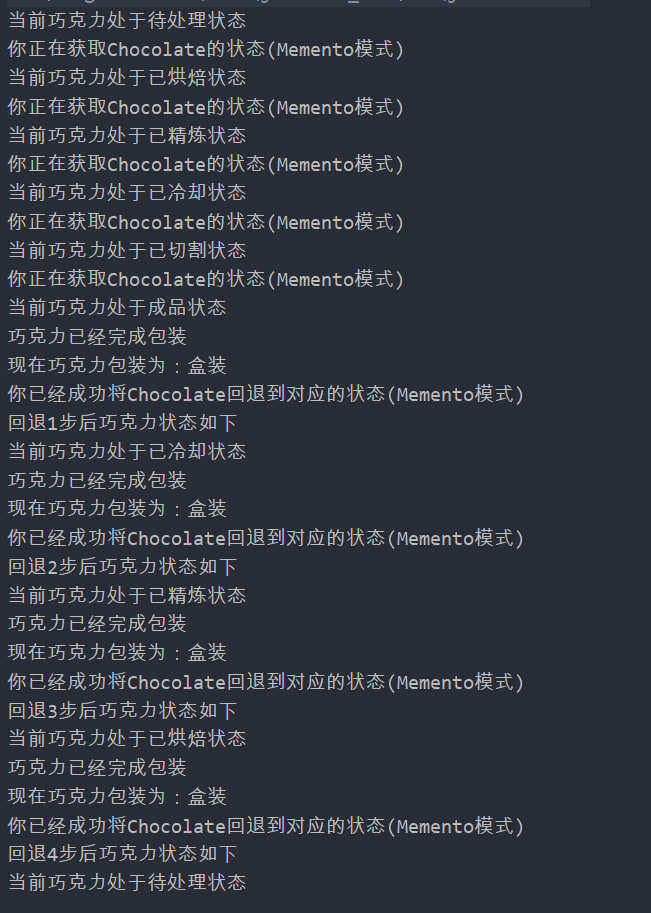

## Memento

### 测试逻辑

创建一个巧克力对象，依次设置巧克力在不同的状态，并在不同状态下创建巧克力的备忘录，之后通过备忘录进行回退操作，每回退一个状态输出一次，检测是否成功回退。

### 测试用例

1. 创建一个巧克力对象
2. 设置巧克力的不同状态，并使用getMemento()创建对应的备忘录
3. 一步一步进行回退操作，通过调用setMemento()进行回退

### 功能测试

## 评分

| 设计模式 | Class/Interface API   | framework完成度 （正确性25+合理性25） | Sample program/Application （正确性25+合理性25） | 备注 |
| -------- | --------------------- | ------------------------------------------ | ----------------------------------------------------- | ---- |
| Memento  | chocolateStateMemento | 25+25                                      | 25+25                                                 |      |

