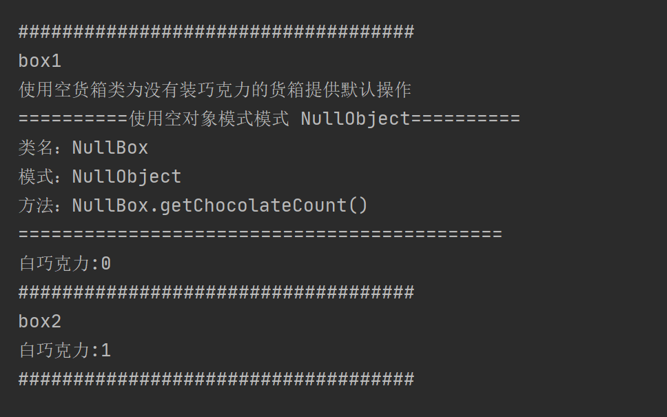

## Null Object

### 测试逻辑

空对象模式(Null Object)类似于给某个类设置默认行为，以应对当该对象为null值时有默认操作，避免程序报错。对象的生成采用工厂模式，工厂模式内部在创建对象实例时检查参数，如果参数可用则创建对应实例对象，否则创建一个空对象类（实际上是默认类的对象实例）

测试时主要测试生成两个虚拟的盒子，一个成功，另一个不成功，分别展示生成效果。

### 测试用例

1. AbstractBox类中的getBox操作，分别得到true和false的生产结果的两个盒子。
2. 对生成结果分别进行打印。

### 功能测试

注：对于NullObject示例中空箱子生成失败的效果，有待商榷。

## 评分

| 设计模式     | Class/Interface API                                          | framework完成度 （正确性25+合理性25） | Sample program/Application （正确性25+合理性25） | 备注 |
| ------------ | ------------------------------------------------------------ | ------------------------------------------ | ----------------------------------------------------- | ---- |
| Null  Object | Class： AbastractBox Interface API ： getBox、 box.addChocolate  | 24+25                                      | 25+25                                                 | 无   |

