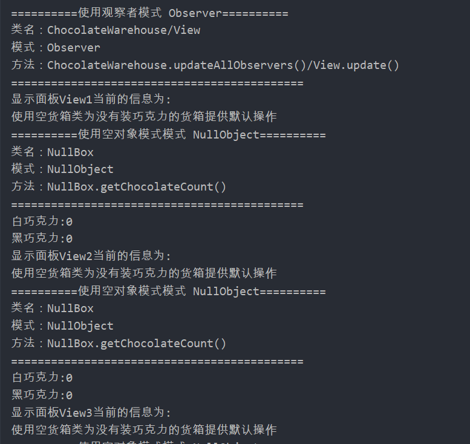
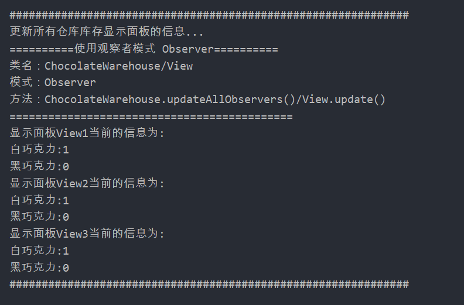

## Observer

### 测试逻辑

在巧克力仓库中有多个面板，面板作为观察者，仓库类可以对所有的面板进行更新操作。

### 测试用例

1. 创建一个巧克力仓库对象
2. 添加三个View对象作为观察者
3. 输出所有观察者的信息
4. 在巧克力仓库中添加一个巧克力
5. 再次输出所有观察者的信息

### 功能测试

## 评分

| 设计模式 | Class/Interface API                                          | framework完成度 （正确性25+合理性25） | Sample program/Application （正确性25+合理性25） | 备注                                                   |
| -------- | ------------------------------------------------------------ | ------------------------------------------ | ----------------------------------------------------- | ------------------------------------------------------ |
| Observer | Class： ChocolateWarehouse View Interface： Observable ObserverView | 25+21                                      | 25+25                                                 | 有点生搬硬套网上教程的写法，方法名称与实际作用不符合。 |
