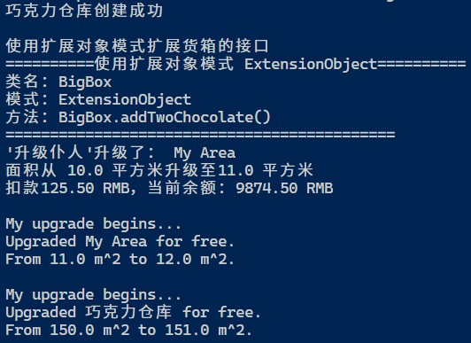

## Servant

### 测试逻辑

根据Servant的逻辑，该设计模式有一个执行相关服务的类和需要获取相关服务的接口。用户需要相关服务的类只需继承该接口。在执行服务的时候，实例化一个Servant类并调用其方法。（以上是Servant的一种实现方法：“用户知晓Servant”。还有一种“Servant与被服务类耦合”的实现方法不在此说明。）

### 测试用例

1. 用户写了一个实现IUpgradeServiced接口的MyArea类。
2. 用户创建了一个MyArea实例myArea。
3. 用户创建了一个UpgradeServant实例servant。
4. 用户调用了servant的upgrade()方法为myArea扩大面积。
5. 用户创建了ChocolateWarehouse（实现了IUpgradeServiced接口）的实例warehouse。
6. 用户调用了servant的upgrade()方法为warehouse扩大面积。
7. 用户写了一个新Servant类MyUpgradeServant，并为其实现了upgrade()方法。
8. 用户创建了MyUpgradeServant的的一个实例servant2。
9. 用户调用了servant2的upgrade()方法为warehouse扩大面积。
10. 【边界测试】用户调用了servant的upgrade()方法并传入负数面积值。

### 功能测试

### 边界测试

## 评分

| 设计模式 | Class/Interface API                                     | framework完成度 （正确性25+合理性25） | Sample program/Application （正确性25+合理性25） | 备注                                                         |
| -------- | ------------------------------------------------------- | ------------------------------------------ | ----------------------------------------------------- | ------------------------------------------------------------ |
| Servant  | IUpgradeServiced.expand() UpgradeServant.upgrade() | 25+25                                      | 25+24                                                 | 【次要问题】IUpgradeServiced.expand()未考虑负数输入，或其合理性未在文档中给出。 |
