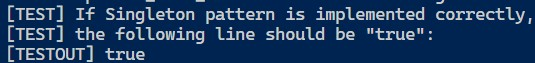

## Singleton

### 测试逻辑

根据Singleton的实现方式，用户能且只能生成一个类实例。故比较任何两个该类引用，指向的都是同一个实例。

### 测试用例

1. 用户通过两次调用ChocolatePlant.getInstance()生成两个引用。
2. 用户判断两个引用是否指向同一个实例。

### 功能测试

## 评分

| 设计模式  | Class/Interface API          | framework完成度 （正确性25+合理性25） | Sample program/Application （正确性25+合理性25） | 备注 |
| --------- | ---------------------------- | ------------------------------------------ | ----------------------------------------------------- | ---- |
| Flyweight | ChocolatePlant.getInstance() | 25+25                                      | 25+25                                                 | 无   |

