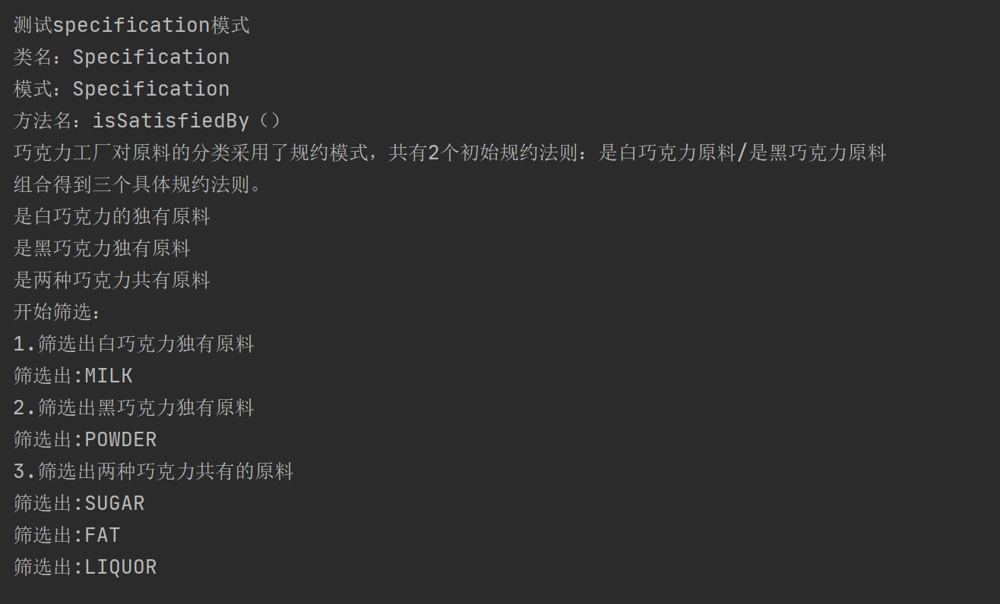
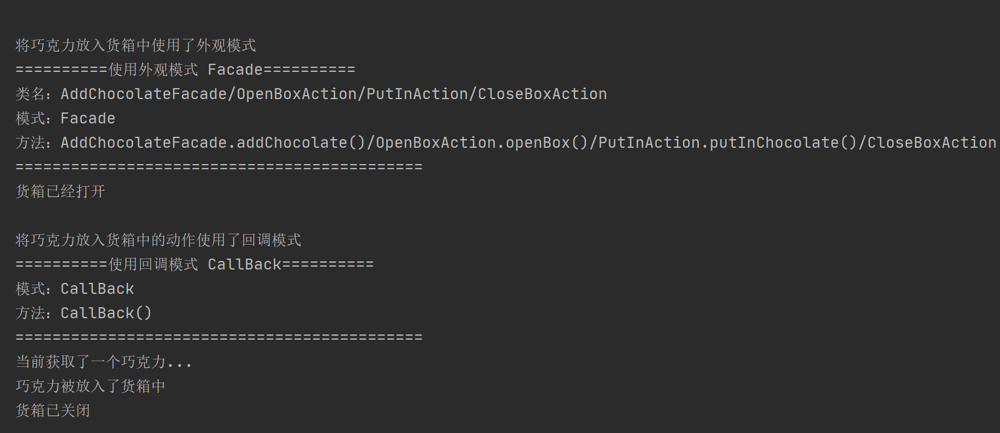

## Specification

### 测试逻辑

在一个较为复杂的业务流程中，某些条件的满足与否决定了业务逻辑的走向，我们可以把这些条件抽离出来，使得任意个条件以某种关系进行组合，从而灵活地对业务逻辑进行定制。另外，在查询、过滤等应用场合中，我们也可以预定义多个条件，使用这些条件的组合来处理查询逻辑，而不是使用逻辑判断语句来处理，那样只会让代码变得复杂。 在Specification设计模式中，一个条件就是一个specification，多个specification通过串联的方式以某种逻辑关系形成一个组合式的specification。

测试时主要测试对黑巧克力和白巧克力分别进行规约模式后，进行筛选操作的情况。

### 测试用例

1. 首先对原料的分类进行规约模式，共有两个规约：黑巧克力和白巧克力。
2. 然后分别对他们的独有原料和共有原料进行打印。
3. 最后进行筛选，分别选出白巧克力的独有原料、黑巧克力的独有原料以及共同原料。

### 功能测试

## 评分

| 设计模式      | Class/Interface API                                          | framework完成度 （正确性25+合理性25） | Sample program/Application （正确性25+合理性25） | 备注 |
| ------------- | ------------------------------------------------------------ | ------------------------------------------ | ----------------------------------------------------- | ---- |
| Specification | Class： Ingredient、Specification Interface API ： isDark、 isWhite、 isSatisfiedBy | 25+25                                      | 25+25                                                 | 无   |

