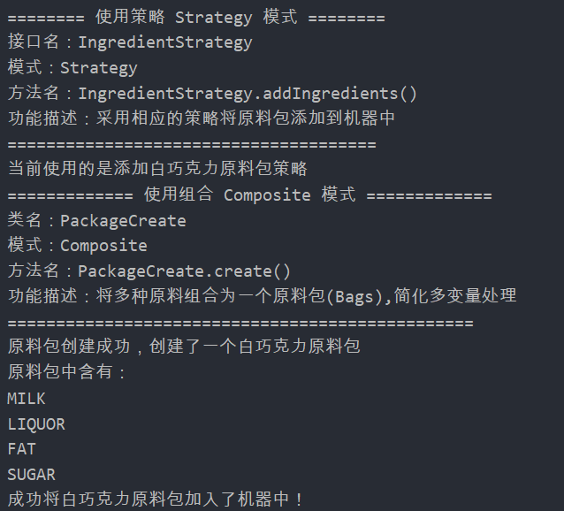
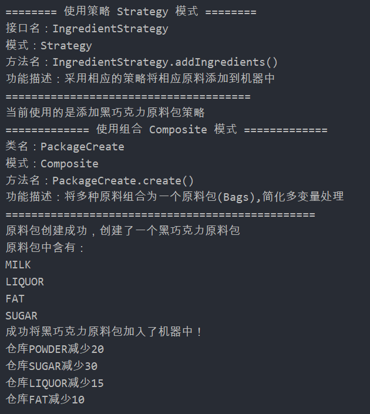

## Strategy

### 测试逻辑

创建一个工人进行添加原料操作，通过设置不同的机制，来添加不同的原料。

### 测试用例

1. 创建一个工人对象（创建过程中使用了其他设计模式，这里不作赘述）
2. 设置创建机制为WhiteIngredient，并进行添加原料操作
3. 设置创建机制为DarkIngredient，并进行添加原料操作

### 功能测试

## 评分

| 设计模式 | Class/Interface API                                         | framework完成度 （正确性25+合理性25） | Sample program/Application （正确性25+合理性25） | 备注 |
| -------- | ----------------------------------------------------------- | ------------------------------------------ | ----------------------------------------------------- | ---- |
| Strategy | IngredientStrategy DarkIngredient WhiteIngredient | 25+24                                      | 25+24                                                 |      |

