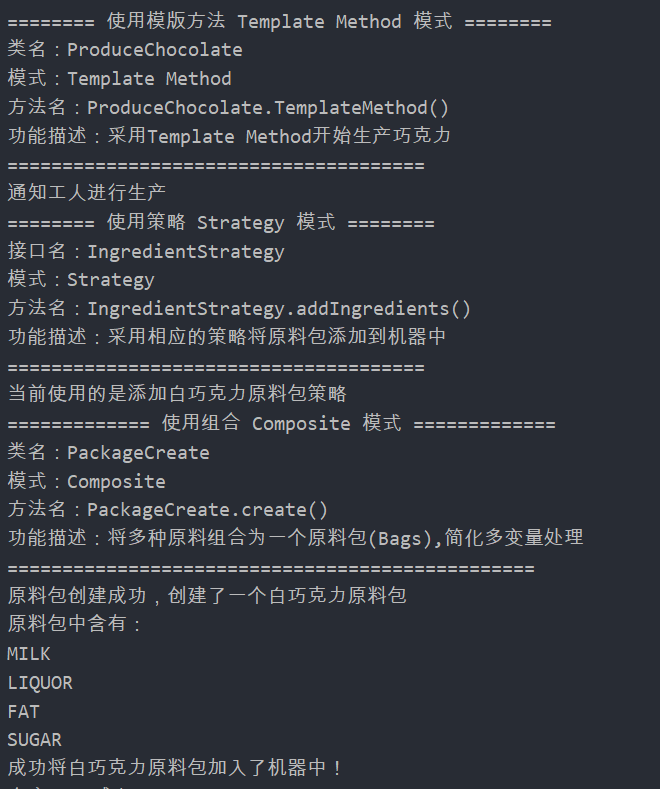
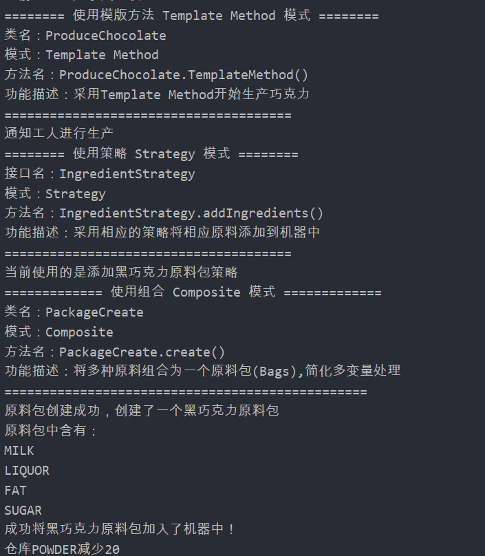

## Template Method

### 测试逻辑

在生产巧克力的操作中测试Template Method模式，首先对巧克力工厂进行初始化，之后分别生成白巧克力和黑巧克力。

### 测试用例

1. 初始化工厂，包括初始化工人、仓库、控制器等。
2. 创建ProduceWhiteChocolate对象，生产白巧克力
3. 创建ProduceBlackChocolate对象，生产黑巧克力

### 功能测试

## 评分

| 设计模式        | Class/Interface API                                          | framework完成度 （正确性25+合理性25） | Sample program/Application （正确性25+合理性25） | 备注 |
| --------------- | ------------------------------------------------------------ | ------------------------------------------ | ----------------------------------------------------- | ---- |
| Template Method | ProduceChocolate ProduceDarkChocolate ProduceWhiteChocolate | 25+22                                      | 25+25                                                 |      |

