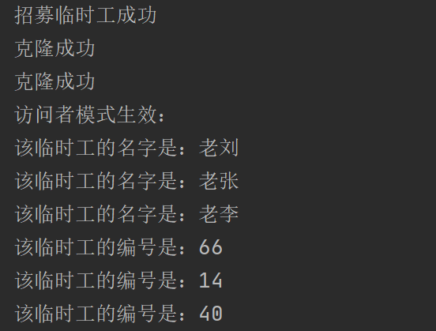

## Visitor

### 测试逻辑

访问者模式（Visitor Pattern）是定义访问者进行访问的方法。将作用于某种数据结构中的各元素的操作分离出来封装成独立的类，使其在不改变数据结构的前提下可以添加作用于这些元素的新的操作，为数据结构中的每个元素提供多种访问方式。它将对数据的操作与数据结构进行分离，是行为类模式中最复杂的一种模式。

测试时主要测试生成一个临时工后，对其进行访问并打印。

### 测试用例

1. 首先根据Visitor基类里的casualLabour()，生成三个具体临时工，对他们分别进行setNumber和setName操作。
2. 然后对他们命名为老刘、老张、老李，并进行allworker中的addStaffs操作。
3. 测试allworker类能否生成不同的临时工：调用allworker类的showReport方法。

### 功能测试

## 评分

| 设计模式 | Class/Interface API                                          | framework完成度 （正确性25+合理性25） | Sample program/Application （正确性25+合理性25） | 备注 |
| -------- | ------------------------------------------------------------ | ------------------------------------------ | ----------------------------------------------------- | ---- |
| Visitor  | Class： Visitor、Allworker Interface API ： casualLaborer、 setNumber、 setName、allworker.addstaffs、allworker.showReport | 25+25                                      | 25+25                                                 | 无   |

